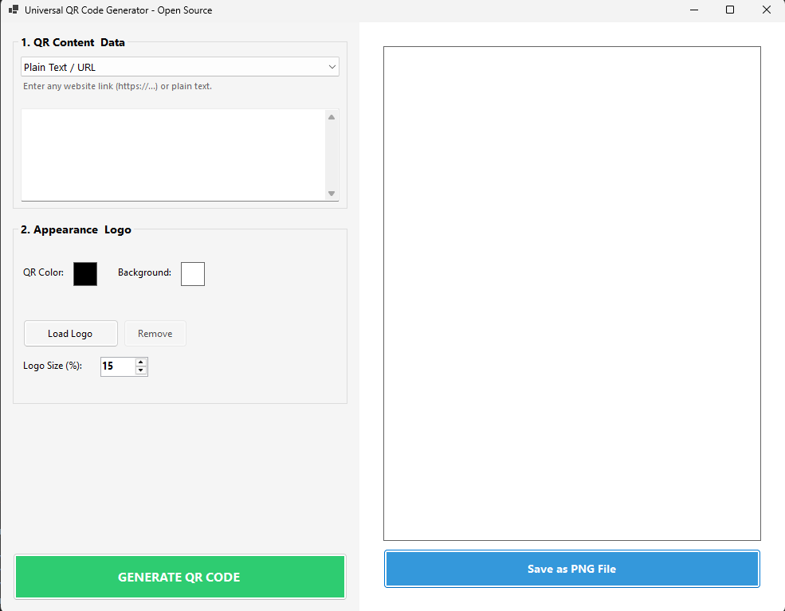
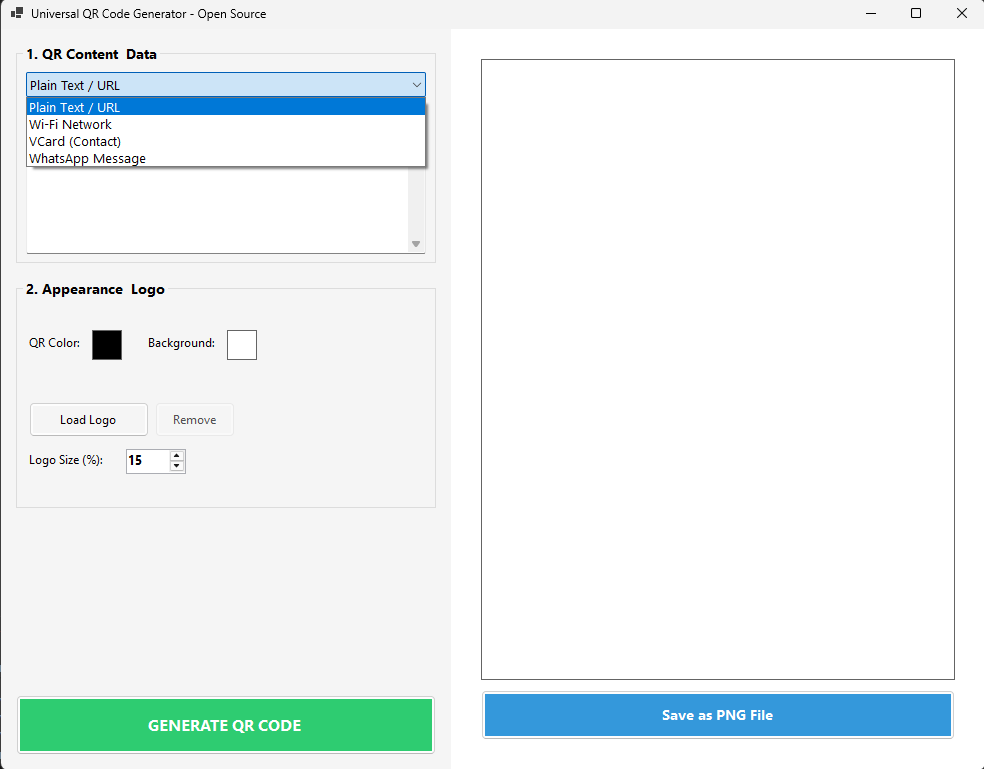
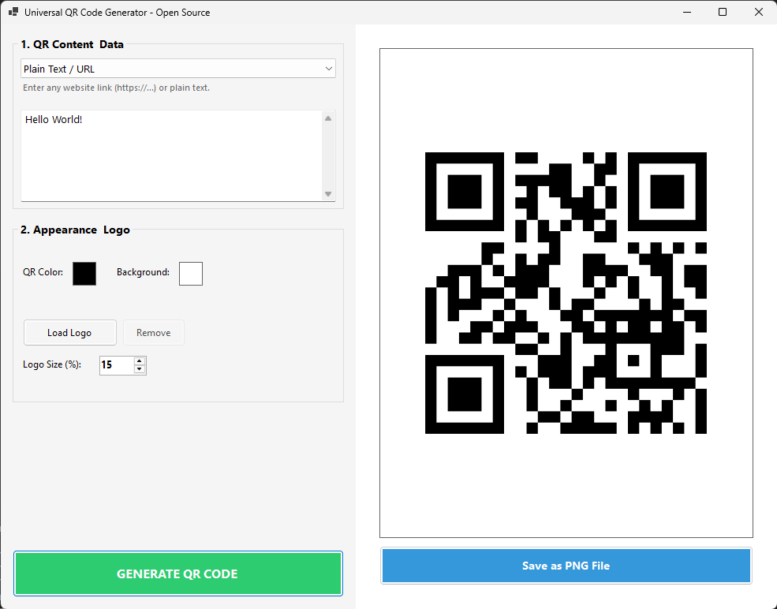

Evet, küçük bir Markdown format sorunu var 👍
Başlık `##` değil, liste numaraları boşluksuz ve “Releases” link değil. Aşağıya tamamen düzeltilmiş ve düzgün hizalanmış halini bırakıyorum:

---

# Universal QR Code Generator 🔳


**Universal QR Code Generator** is an easy-to-use, open-source QR code generation tool developed for Windows. In addition to standard text, it supports special data types such as Wi-Fi, VCard, and WhatsApp.

---

## 📸 Screenshots





---

## ✨ Features

### Wide Data Support

* Plain Text / URL
* Wi-Fi Networks (Automatic connection without manually entering the password)
* VCard (Automatically add contacts to the address book)
* WhatsApp Messages (Start a chat directly)

### Customizable Design

* Change QR code and background colors as you wish
* Smart contrast control: The system automatically warns you if the selected colors are too similar to be readable

### Logo Integration

* Add your own custom logo (PNG/JPG) to the center of the QR code
* Adjust the percentage of the QR area covered by the logo (Displays a warning for sizes >20% to preserve readability)

### Fast Export

* Save generated QR codes in high-resolution PNG format

---

## 🚀 Installation & Usage

### 1. Installation via Setup File (Recommended)

Download the latest **ZIP package** from the
👉 **[Releases](https://github.com/Endoplazmikmitokondri/UniversalQRGenerator/releases)** section.

After downloading:

1. Extract the ZIP file
2. Open the extracted folder
3. Run `UniversalQRGenerator_Setup.exe`
4. Follow the installation steps

No .NET installation is required — the application runs as a self-contained executable.

---

### 2. For Developers (Build from Source)

If you want to build or modify the project on your own machine:

Clone the repository:

```bash
git clone https://github.com/Endoplazmikmitokondri/UniversalQRGenerator.git
cd UniversalQRGenerator
dotnet build
```

---
